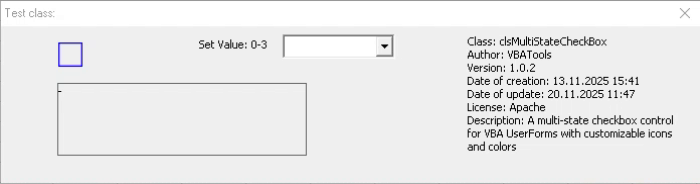

# Multi-State CheckBox VBA Class



A VBA class implementation that provides a multi-state checkbox control with three or more states: unchecked, checked, and indeterminate.

## Features

- Three-state checkbox functionality (unchecked, checked, indeterminate)
- Customizable appearance and behavior
- Easy integration with VBA UserForms
- Reusable class module for consistent checkbox behavior
- Cyclic/non-cyclic state switching (property `Cyclic`)
- Ability to set/get state by text (property `StateText`)
- Method to get all available states (`GetAllStates`)
- Improved error handling and validation
- Ability to set font name and size factor (properties `FontName` and `FontSizeFactor`)
- Ability to get/set current icon (property `CurrentIcon`)
- Method to set color for specific state (`SetStateColor`)
- Method to reset to initial state (`ResetToInitialState`)

## Default Icons and Colors

- Default icons: Uses Segoe MDL2 Assets font with character codes 59193 (unchecked), 59194 (checked), and 59195 (indeterminate)
- Default color: Black (vbBlack) for all states
- Hover effect: Lightens the icon color when hovering over the checkbox

## Files

- `clsMultiStateCheckBox.cls` - Main class implementation
- `frmTestClass.frm` - Test form demonstrating usage
- `modShowForms.bas` - Module with form display functions
- `multi_state_checkbox_v2.xlsm` - Excel workbook containing the implementation

## Usage

### Initializing in a UserForm

To use the multi-state checkbox in your UserForm:

1. Add a Label control to your form that will serve as the checkbox
2. Import the `clsMultiStateCheckBox.cls` class module into your VBA project
3. In your form's code, declare an instance of the class:

```vba
Dim mCheckBox As clsMultiStateCheckBox

Private Sub UserForm_Initialize()
    ' Initialize with default parameters
    Set mCheckBox = New clsMultiStateCheckBox
    mCheckBox.Initialize Me.Label1 ' Replace Label1 with your label control
End Sub

' Example with all optional parameters:
' Initialize(LabelBtn As MSForms.Label, _
'         Optional Item As Byte, _
'         Optional arrIcon As Variant, _
'         Optional ArrIconColor As Variant)
'
' Where:
' - LabelBtn: The label control to use as the checkbox
' - Item: Initial state (0 for unchecked, 1 for checked, 2 for indeterminate, etc.)
' - arrIcon: Array of icon character codes (default is Array(59193, 59194, 59195))
' - ArrIconColor: Array of colors for each state (default is Array(vbBlack))

Private Sub UserForm_Initialize()
    ' Example with all optional parameters specified
    Set mCheckBox = New clsMultiStateCheckBox
    
    ' Define custom icons (in this case, using Segoe MDL2 Assets)
    Dim customIcons As Variant
    customIcons = Array(59193, 59194, 59195) ' Unchecked, checked, indeterminate
    
    ' Define custom colors for each state
    Dim customColors As Variant
    customColors = Array(vbBlack, vbBlue, vbRed) ' Colors for each state
    
    ' Initialize with custom parameters
    mCheckBox.Initialize Me.Label1, 0, customIcons, customColors
End Sub
Private Sub UserForm_Terminate()
    Set mCheckBox = Nothing
End Sub

' Additional Features:
' - Cyclic property: Controls whether the checkbox cycles through states or stops at the last state
' Example of using Cyclic property:
' mCheckBox.Cyclic = False ' This will make the checkbox stop at the last state instead of cycling back to the first
'
' - StateText property: Allows getting and setting the state by text value
' Example of using StateText property:
' Dim currentState As String
' currentState = mCheckBox.StateText ' Gets the current state text
' mCheckBox.StateText = ChrW$(59194) ' Sets the state to the specified text (in this case, checked state)
'
' - GetAllStates method: Returns an array of all available state texts
' Example of using GetAllStates method:
' Dim allStates As Variant
' allStates = mCheckBox.GetAllStates ' Gets all available state texts
'
' - FontName property: Allows setting the font name for the checkbox
' Example of using FontName property:
' mCheckBox.FontName = "Wingdings" ' Sets the font to Wingdings
'
' - FontSizeFactor property: Allows setting the font size factor for scaling
' Example of using FontSizeFactor property:
' mCheckBox.FontSizeFactor = 0.8 ' Sets the font size to 80% of the width
'
' - CurrentIcon property: Allows getting and setting the current icon by code
' Example of using CurrentIcon property:
' Dim currentIcon As Long
' currentIcon = mCheckBox.CurrentIcon ' Gets the current icon code
' mCheckBox.CurrentIcon = 59194 ' Sets the current icon to a specific code
'
' - SetStateColor method: Allows setting the color for a specific state
' Example of using SetStateColor method:
' mCheckBox.SetStateColor 1, RGB(255, 0, 0) ' Sets the second state color to red
'
' - ResetToInitialState method: Allows resetting the checkbox to an initial state
' Example of using ResetToInitialState method:
' mCheckBox.ResetToInitialState 0 ' Resets the checkbox to the first state (index 0)

```

4. The checkbox will now function with three states that cycle when clicked

## License

This project is licensed under the terms specified in the [LICENSE](./LICENSE) file.